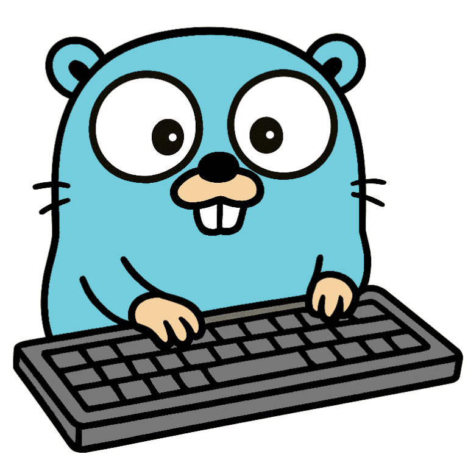

<p align="center">
    
</p>

<h1 align="center">Golloom</h1>

Golloom is a robust Go library designed to facilitate seamless integration and interaction with language models via Ollama. It provides developers with a comprehensive set of tools to manage models, generate prompts, and handle responses efficiently within Go applications.

- **Model Management**: Easily pull and push models to and from the Ollama server, ensuring synchronization and version control.​
- **Prompt Generation**: Craft and send prompts to Ollama language models, receiving structured responses tailored to your application's needs.​
- **Process Monitoring**: Monitor the status of model processes, allowing for effective resource management and debugging.​
- **Version Retrieval**: Fetch version information of the application to maintain compatibility and track updates from Ollama.

## Installation

To incorporate Golloom into your Go project, use go get:

```sh
go get github.com/nthnn/golloom
```

## Basic Usage

```go
package main

import (
	"bufio"   // Package bufio implements buffered I/O.
	"context" // Package context defines the Context type, which carries deadlines, cancellation signals, and other request-scoped values.
	"fmt"     // Package fmt implements formatted I/O with functions analogous to C's printf and scanf.
	"log"     // Package log implements simple logging.
	"os"      // Package os provides a platform-independent interface to operating system functionality.
	"strings" // Package strings implements simple functions to manipulate UTF-8 encoded strings.

	"github.com/nthnn/golloom" // Importing the Golloom package for interacting with language models.
)

func main() {
	// Initialize a new Golloom client to interact with the Ollama language model server.
	// The client connects to the server at "http://localhost:11434" with a timeout of 12 minutes.
	client, err := golloom.NewClient("http://localhost:11434", 12)
	if err != nil {
		log.Fatalf("Error creating client: %v", err) // Log and exit if client creation fails.
	}

	var history []golloom.Message // Slice to store the history of messages exchanged in the chat.
	ctx := context.Background()   // Create a background context for the chat operations.

	reader := bufio.NewReader(os.Stdin) // Create a buffered reader to read input from the standard input (console).

	for {
		fmt.Print(">> ") // Display the prompt for user input.

		// Read the user's input until a newline character is encountered.
		input, err := reader.ReadString('\n')
		if err != nil {
			log.Fatalf("Error reading input: %v", err) // Log and exit if reading input fails.
		}
		input = strings.TrimSpace(input) // Trim any leading or trailing whitespace from the input.

		// Check if the user wants to exit the chat.
		if input == "exit" {
			break // Exit the loop and end the program.
		}

		// Append the user's message to the chat history.
		history = append(history, golloom.Message{
			Role:    "user", // Role of the message sender.
			Content: input,  // Content of the user's message.
		})

		// Create a new chat request with the current history of messages.
		chatReq := &golloom.Chat{
			Model:    "deepseek-r1:14b", // Specify the model to use for generating responses.
			Messages: history,           // Include the chat history in the request.
		}

		// Send the chat request to the server and receive a response.
		chatResp, err := client.Chat(ctx, chatReq)
		if err != nil {
			log.Fatalf("Chat error: %v", err) // Log and exit if the chat request fails.
		}

		// Extract the assistant's message from the chat response.
		assistantMessage := chatResp.Message.Content
		fmt.Println(assistantMessage) // Display the assistant's response to the user.

		// Append the assistant's message to the chat history.
		history = append(history, golloom.Message{
			Role:    "assistant",      // Role of the message sender.
			Content: assistantMessage, // Content of the assistant's message.
		})
	}
}
```

## License

```
Copyright 2025 Nathanne Isip

Licensed under the Apache License, Version 2.0 (the "License");
you may not use this file except in compliance with the License.
You may obtain a copy of the License at

    http://www.apache.org/licenses/LICENSE-2.0

Unless required by applicable law or agreed to in writing, software
distributed under the License is distributed on an "AS IS" BASIS,
WITHOUT WARRANTIES OR CONDITIONS OF ANY KIND, either express or implied.
See the License for the specific language governing permissions and
limitations under the License.
```
